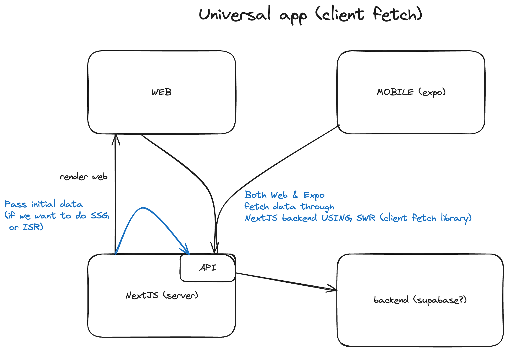

# Data fetching for Native and Web

## Problem

Decide on how to fetch data for both native & web.

## Critical Performances

- Developer Experience
- Performance
- Features
- Bugs

## Relevant research

- [Github issue asking a similar question.](https://github.com/nandorojo/solito/discussions/50)

## Options

### All data is fetched through the NextJS Server API

- This way we define one entry point for all backend calls. It also leaves the backend behind it platform agnostic.
- Use client side fetching library like SWR to handle the calls for both native and web.
- UI component takes an optional 'data' prop which can be passed to SWR's `fallbackData` when we do `useSWR`. Similar thing can happen if we wanted to use tanstack query.
- On Web, statically fetch the data (on the server), and pass it as a prop to the screen so it has the data on first render -> This is what we would want if we wanted SSG or ISR for the web.
- We can share the data fetching logic e.g having async functions that do the fetch logic.

Open questions:

- Would this be compatible with graphql?
