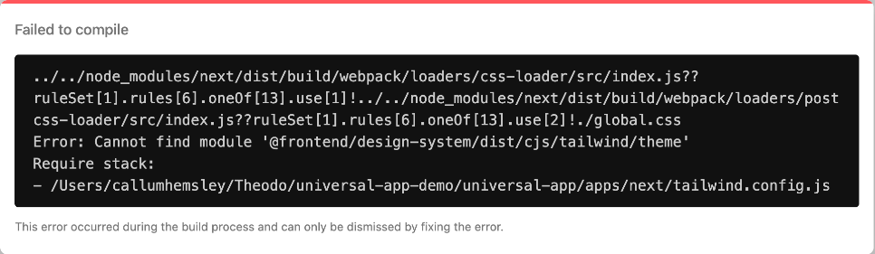
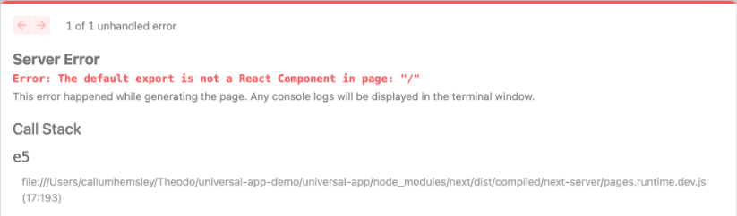

<h1 align="center">
  create-universal-app
</h1>

  ✨ Enabler repo to start a typesafe, universal Expo & Next.js app ✨

  Get started with the by running <code>npx create-universal-enabler-app my-app</code>

And just like that, you now have an Expo + Next.js app that is styled with Tailwind CSS.

## 🍔 The Create Universal App Stack

The Create Universal App Stack is a universal web and native stack made by Theodo UK focused on **developer experience**, **rapid development**, and **performance**.

### The core stack

- [Expo](https://expo.dev) 50 for apps & TV.
- [NextJS](https://nextjs.org) 14 (With React Native Web components) for web.
- [Solito](https://solito.dev) for shared navigation logic.
- [NativeWind](https://nativewind.dev) for shared styling.
- [Turborepo](https://turbo.build/) monorepo to handle building our packages.

  &nbsp;
  &nbsp;
  

_And optional extensions via CLI (Coming soon):_

- Graphql setup for client & NextJS backend API.
- React Server Components for Next (with client side calls still working for Expo side)

## Table of Contents

1. [Quickstart](#🏁-quick-start)
   - [Troubleshooting (Common Errors)](#troubleshooting-common-errors)
2. [Archi Diagram](./docs/images/archi-diagram.svg)
3. [Creating a custom package](./docs/how-to/create-a-custom-package.md)
4. [Installing new libraries](./docs/how-to/installing-libraries.md)
5. [Data fetching architecture](./docs/adrs/data-fetching-architecture.md)
6. [Package structure](./docs/adrs/package-structure.md)

## 🏁 Quick start

- Install dependencies at the root level: `yarn`
- Build all packages with `yarn build`
  - When developing, you can run `build-watch` to get packages rebuilt on save
- Next.js local dev: `yarn web`
  - Runs `yarn next`
- Expo local dev:
  - First, build a dev client onto your device or simulator
    - `cd apps/expo`
    - Then, either `expo run:ios`, or `eas build`
  - After building the dev client, from the root of the monorepo...
    - `yarn native` (This runs `expo start --dev-client`)

## Troubleshooting (Common Errors)

`Tailwind.config.js error`

  

- If you get something like this, you've most likely not built the packages correctly - Try `yarn build`.

`default export is not a React Component`

  

- Try starting the web/app _clearing the cache_ - `yarn web-clear-cache` or `yarn native -c`

## Archi Diagram

[Archi Diagram](./docs/images/archi-diagram.svg)
